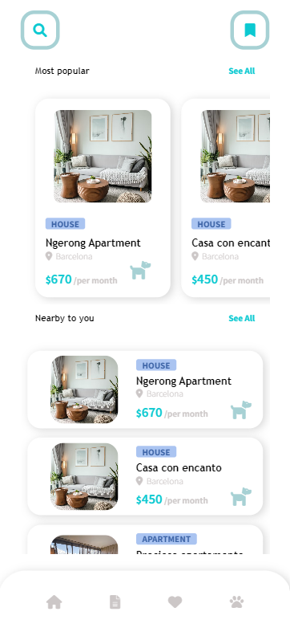
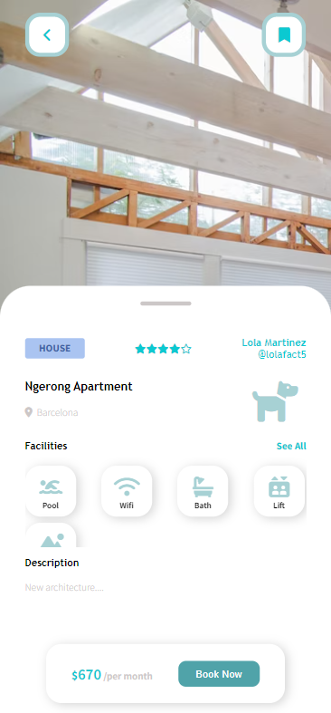

# Way Home App
React App developed for the 2022 F5 Hackathon organized by Factoria F5 and Thoughtworks. 

This app was developed given a basic functional requirements designed by the Hackaton organization. It follows a MarketPlace structure where a potential Client uploads an Announcement and the User interacts with it and decides whether to contact (make a match) the Client or not.

Taking all the specifications required we decided to develop a real estate portal focused in those who are in research of a pet-friendly housing.


## Tech Stack
+ HTML 5
+ CSS 3
+ REACT

### Rest API
+ [Way Home API](https://github.com/afonttorres/way-homeAPI)

### Version control
+ GIT
+ Git Hub

### Development tools & libraries
+ Visual Studio Code
+ Postman
+ Axios

## Objectives
This project was build around the Announcement, the main entitiy of the application and corresponds to the Housing which must contain a Publisher (Client) and the specifiactions that may take Users attention as well as housing images' and the pets who live there. The aim is to put in contact pet-friendly landlords with those pet-owners who are looking for a housing.

The functional requirements of this project were divided by sprints which were developed by importance using Agile Methodologies as Kanban and Scrum.

Being the main entity of the project our first sprint consited in display all available housings and its details. Once we got satisfied with the work done we moved to the next sprint whereby we added a searcher so user could filter its preferences. Finally, we gave the user the capability to make a match with the announcement (Housing) and therefore with the owner (Client). 

Given the conditions of the Hackaton (was a 48 hours hackaton) this project turns out to be unfinished but we are looking forward to add new features and end those which are not finished yet. 


## Features
### Housing CRUD
+ Display all housings
+ Display the detail of a single housing
+ Search housings by location, description, title or pet

### Match CRUD
+ Create a match between the user and the announcement (and therefore the publisher)


### Design
+ Responsive Web Design
+ Modularity and Scalability (by using React components)

## Preview
#### Desktop


#### Mobile





## Next
We'd like to add a register and login form for both users and clients so they can be part of the database and authenticate themselves in the application to improve their user experience since we planned our application to be a save place for everyone. Therefore only authenticated users can concact (make match with the announcement) the housing publisher.

Taking this into account, we planned to add a messenger service so publishers can enable a chat with those tenants who are interested in their housings only if they agree with the user profile. They would enable the chat by accepting the match, otherwise the match status would remain pending.

Since our searcher is very inespecific we'd like to modify it and add filters so the search can be more accurated.

Lastly, as its the main point of the application, we'll add a form to upload announcements and update them as well as delete them when the match is completed or publisher desires to erase his housing from the database.

We expect many more features will come on the go.

## Authors
+ [Laia Añó](mailto:laiaafernandez18@gmail.com)
+ [Laura Wynter](https://github.com/Laurawynter)
+ [Christina Paucar](https://github.com/Christyg24)
+ [Marielle Ibias](https://github.com/marielleia)
+ [Susana Martínez](https://github.com/Susipro)
+ [Raquel Gil](https://github.com/Rgildeprado)
+ [Agnès Font](https://github.com/afonttorres)

## Installation

This project was bootstrapped with Create React App therefore requires node.js and npm.  Once you've verified node is installed in your directory take the following steps:

#### 1. Clone the repository
```bash
 https://github.com/afonttorres/moments.git
```


#### 2. Run the app in development mode
```bash
 npm start
 ``` 